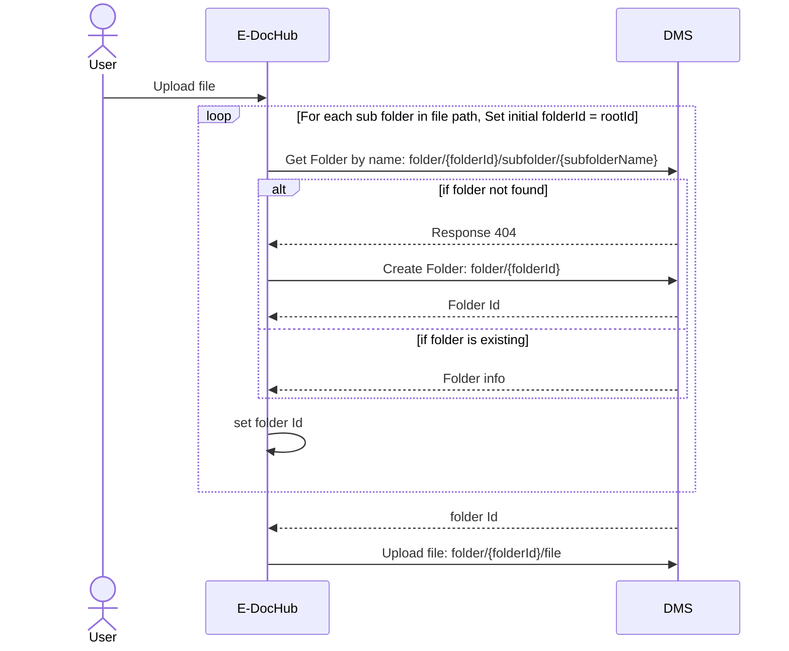

# Sequence Diagram: E-DocHub & DMS — Folder Management

```mermaid
sequenceDiagram
    actor User
    participant E as E-DocHub
    participant D as DMS

    User->>E: Upload file

    loop For each sub folder in file path, Set initial folderId = rootId
        E->>D: Get Folder by name: folder/{folderId}/subfolder/{subfolderName}
        alt if folder not found
            D-->>E: Response 404
            E->>D: Create Folder: folder/{folderId}
            D-->>E: Folder Id
        else if folder is existing
            D-->>E: Folder info
        end
        E->>E: set folder Id
    end

    D-->>E: folder Id
    E->>D: Upload file: folder/{folderId}/file
```
