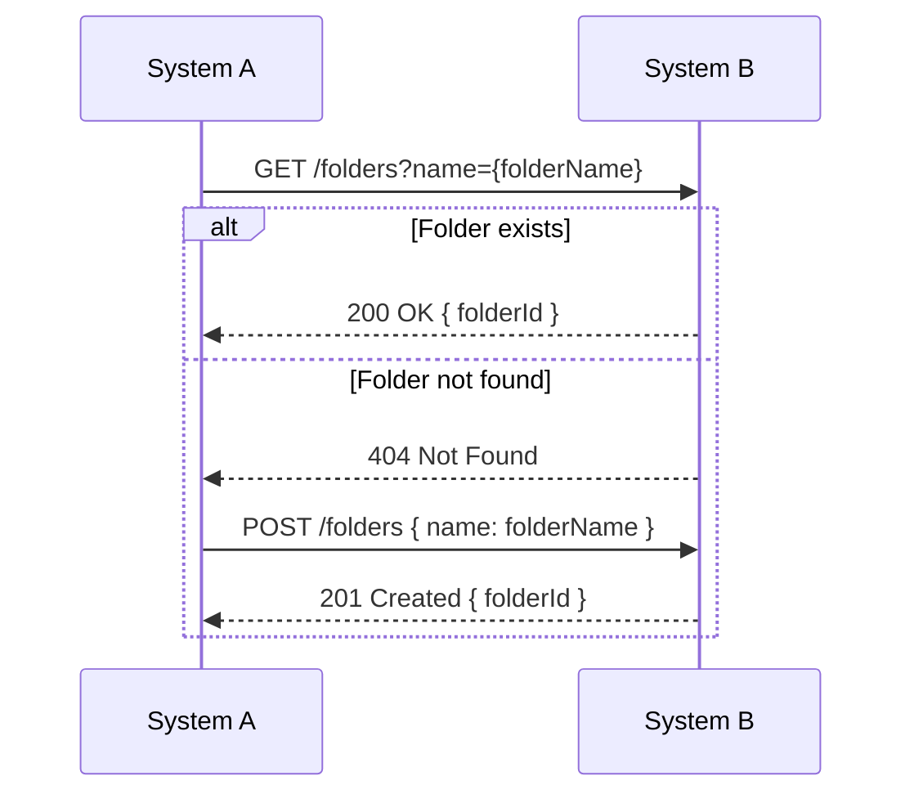

# Sequence Diagram: System A & System B — Folder Management

```mermaid
sequenceDiagram
    participant A as System A
    participant B as System B

    A->>B: GET /folders?name={folderName}
    alt Folder exists
        B-->>A: 200 OK { folderId }
    else Folder not found
        B-->>A: 404 Not Found
        A->>B: POST /folders { name: folderName }
        B-->>A: 201 Created { folderId }
    end
```
